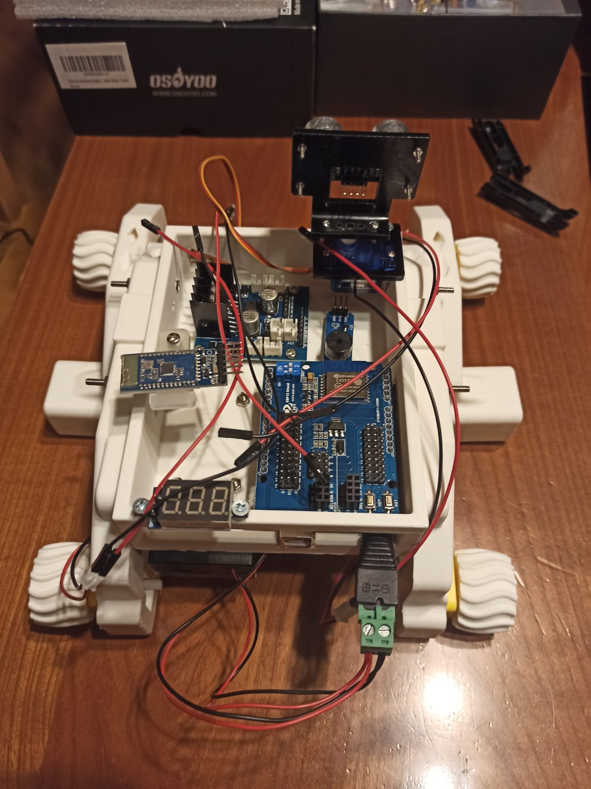
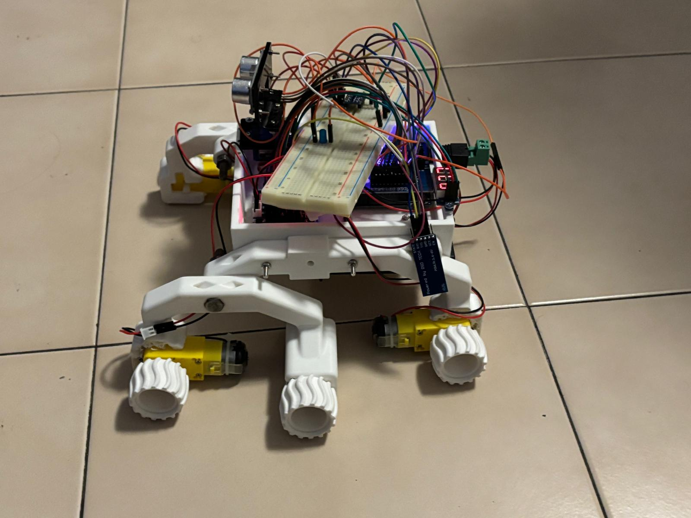
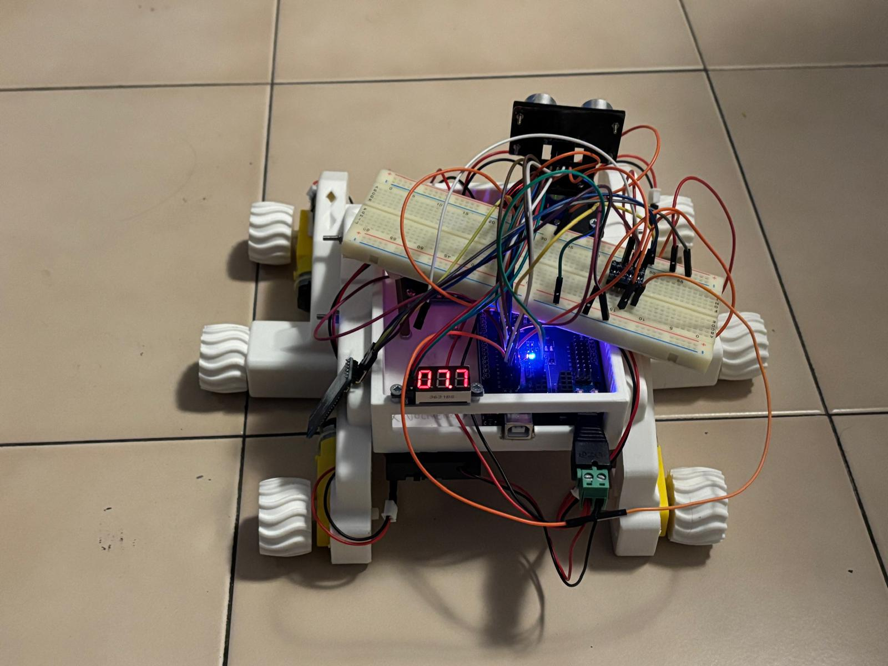

<h1 align="center">The Mars Rover: WALL-E</h1>

With this project we aim to get a better understanding of what skills developing a Mars Rover takes.

<i>"How does a Rover really work?","What actions or characteristics define a machine as a Rover?","How can we transmit and receive data from the Rover?"</i>

While it would be challenging to build a full functioning Mars Rover in a limited timeframe, understanding how they work and the challenges engineers face, can give us a greater appreciation for the level of innovation and precision that goes into their development.

<h3 align="center">The finished Product</h3>

 

<h2 align="center">Link to the Youtube video</h2>

 

Here you'll find the link to the video of the project: <a href = "https://www.youtube.com/watch?v=d_bhMyztT9k">https://www.youtube.com/watch?v=d_bhMyztT9k</a>

 

<h2 align="center">Components</h2>

<h3 align="center">Physical Components Used</h3>

<ul>
    <li>a few (a lot) 3d printable components</li>
    <li>4x mini servomotors of 3v outtage</li>
    <li>27x Jumpers Arduino</li>
    <li>1x Micro Servo motor SG90</li>
    <li>1x Arduino compatible Voltmeter</li>
    <li>1x Arduino OSOYOO UNO Board</li>
    <li>1x Arduino ESP8266 Shield for Arduino</li>
    <li>1x Buzzer compatible with Arduino</li>
    <li>1x Module Driver Motors OSOYOO Model X</li>
    <li>1x Bluetooth sensor Arduino compatible HC-05</li>
    <li>1x Ultrasonic sensor HC-SR04</li>
    <li>nx Various screws and knobs to model the Body of the Rover</li>
    <li>1x BatteryPack</li>
        <ul>
        <li>2x Rechargable Batteries of 3.7V, ~3.000 mA</li>
        <li>1x Batteries Charge Station</li>
        </ul>
    <li>1x Texas Instruments MSP432P401R</li>
    <li>1x Texas Instruments BoosterPack MKII</li>
    <li>1x Breadboard</li>
    <li>1x Logic level converter</li>
    <li>1x LED</li>
    <li>1x PC/LAPTOP</li>
</ul>

<h3 align="center">Software Used</h3>

<ul>
    <li>Visual Studio Code</li>
    <li>Arduino IDE</li>
    <li>Energia IDE</li>
    <li>Putty Serial Communication App</li>
    <li>Windows CMD/Powershell</li>
</ul>

<h3 align="center">Programming Languages used</h3>

<ul>
    <li>C/C++</li>
    <li>Python</li>
</ul>

<h3 align="center">Libraries used</h3>

<ul>
    <li>Python library:serial</li>
    <li>Arduino library: SoftwareSerial.h , Servo.h</li>
</ul>

<h2 align="center">Project Layout</h2>

<pre>
<code>
ROVER WALL-E
│
├── README.md
├── LICENSE (MIT defined)
├── rover_exoscheleton               # stl used for the exoskeleton of the rover
├── images_readme                   
│   └──images                        # images used inside the readme
├── images_schematics               
│  └──images                         # schematics of the Arduino jumpers connections in the Rover
├── videos
│  └── snippets                      # snipepts of the pitch video
├── Presentation                     # presentation of the project
└── Our Code
    ├── ArduinoUNO                   # Arduino side code
    │   ├── ComponentsCode           # Components template code with testing before implementation
    │   └── RoverFinalSketch         # Final sketch to be burned into the Rover
    ├── MSP43P401R                   # Texas side code
    └── SideCode                     # Side code to make the BT module connect to the pc 
</code>
</pre>

<h2 align="center">How to Reproduce the Project</h2>

<h3 align="center">Goals</h3>

<ul>
    <li>Sending commands from MSP432 (with attached a BoosterPack) to arduino via bluetooth to control the rover </li>
    <li>Commands that can eb Issued:</li>
    <ul>
        <li>F(Forward)</li>
        <li>B(Backward)</li>
        <li>L(Left)</li>
        <li>R(Right)</li>
        <li>P(rovers' led on)</li>
        <li>W(rovers' led off)</li>      
    </ul>
    <li>Sending rovers' led status and ultrasonic data from arduino to the pc/laptop</li>
    <li>The multicolor LED integrated into the BoosterPack operates in accordance with control commands (e.g., LED ON/OFF) transmitted by the Arduino.</li>
</ul>

<h3 align="center">Steps</h3>
<ol>
    <i>After you printed the Rover Components and built its exoscheleton</i>
    <li>Upload the MSP code on MSP432 using <a href="https://energia.nu/">Energia IDE</a> (check that the baudrate of the MSP and the BT Port are the same)</li>
    <li>Test whether the commands are sent correctly using serial monitor (Close the serial monitor to free the port after you finished testing)</li> 
    <li>Upload "RoverArduinoFinalSketch.ino" on Arduino Uno using Arduino IDE (again, check that the baudrate of the board and BT Module are compatible)</li>
    <li>Power up the rover</li>
    <li>Enstablish the connection between pc and HC05 using <a href="https://www.putty.org/">PuTTY</a></li>
    <li>Run the python script quickly after closing PuTTY </li>
    <i>The Rover at this point should have commenced the "Ambiental Scan", sent the Scan start/end message and the obstacles position</i>
    <li>Use the two buttons integrated into the BoosterPack to activate and deactivate the rover's LED to test the communication. Once the LED ON/OFF message is received from the Arduino, the BoosterPack's multicolor LED should turn on/off respectively.</li>
    <li>Use the joystick to control the rovers' movement, and the two buttons integrated into the BoosterPack to activate and deactivate the rover's LED.</li>
    <i>Remember, if you want to Re-Scan the environment, the Rover has to stay still for ~5 seconds (receive 10 S signals)</i>
</ol>

<h3 align="center">Contributors</h3>

<i>Agosti Tommaso, Nodari Francesco, Wu Alessio, Wu Davide</i>

 

<h6>
<i>
<ul>
    <li>RICORDA</li>
    <li>non funziona se non cade una sigaretta elettronica almeno 15 volte</li>
    <li>RX e TX non sono posizionati correttamente, scambiali... oppure no?</li>
    <li>hc-05 non funziona coi 5V!!! breadboard joins the chat</li>
    <li>Pin 0 e 1 non sono da utilizzare o ti esplode il buffer!!! (servono per il debug e il monitor seriale)</li>
</ul>
</i>
</h6>
