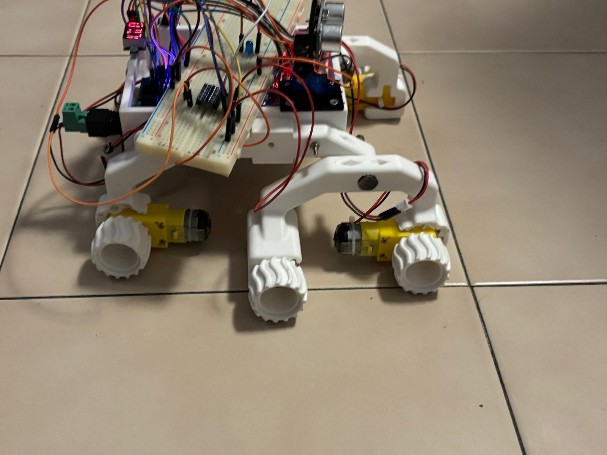

<h1 align="center">The Mars Rover</h1>

With this project we aim to get a better understanding of what skills developing a Mars Rover takes.

<i>"How does a Rover really work?","What defines a Rover?","How can we make it connect to an external Module?"</i>

While it would be challenging to build a full Mars Rover in a limited timeframe, understanding how they work and the challenges engineers face can give us a greater appreciation for the level of innovation and precision that goes into their development.

<h3 align="center">The finished Product</h3>

 

<h2 align="center">Components</h2>

<ul list-style-type: "square">
    <li>a few (a lot) 3d printable components</li>
    <li>4x mini servomotors of 3v outtage</li>
    <li>27x Jumpers Arduino</li>
    <li>1x Micro Servo motor SG90</li>
    <li>1x Arduino compatible Voltmeter</li>
    <li>1x Arduino OSOYOO UNO Board</li>
    <li>1x Arduino ESP8266 Shield for Arduino</li>
    <li>1x Buzzer compatible with Arduino</li>
    <li>1x Module Driver Motors OSOYOO Model X</li>
    <li>1x Bluetooth sensor Arduino compatible HC05</li>
    <li>1x Ultrasonic sensor Arduino compatible HC-SR04</li>
    <li>nx Various screws and knobs to model the Body of the Rover</li>
    <li>1x Texas Instruments MSP432P401R</li>
    <li>1x Texas Instruments BoosterPack MKII</li>
    <li>1x Breadboard</li>
    <li>1x Logic level converter</li>
    <li>1x LED</li>
    <li>PC/LAPTOP</li>
</ul>

<h3 align="center">Software</h3>

<ul>
    <li>Visual Studio Code</li>
    <li>Arduino IDE</li>
    <li>Energia IDE</li>
    <li>Putty Serial Communication App</li>
    <li>Windows CMD/Powershell</li>
</ul>

<h3 align="center">Programming Language</h3>

<ul>
    <li>C/C++</li>
    <li>Python</li>
</ul>

<h3 align="center">Library</h3>

<ul>
    <li>Python library:serial</li>
    <li>Arduino library: SoftwareSerial.h , Servo.h</li>
</ul>

<h3 align="center">Project Layout</h3>

<pre>
<code>
ROVER WALL-E
│
├── README.md
├── LICENSE (MIT defined)
├── rover_exoscheleton               # stl used for the exoskeleton of the rover
├── images_readme                   
│   └──images                        # images used inside the readme
├── images_schematics               
│  └──images                         # schematics of the Arduino jumpers connections in the Rover
├── videos      
│  ├── Rover Wall-E                  # integral video of the Rover
│  └── snippets                      # parts of the video
├── presentation!!                   # presentation of the project
└── Our Code
    ├── ArduinoUNO                   # Arduino side code
    │   ├── ComponentsCode           # Components template code with testing before implementation
    │   └── RoverFinalSketch         # Final sketch to be burned into the Rover
    ├── MSP43P401R                   # Texas side code
    └── SideCode                     # Side code to make the BLE module to connect to the pc 
</code>
</pre>

<h2 align="center">How to Reproduce the Project</h2>

<h3 align="center">Goals</h3>

<ul>
    <li>Sending commands from msp to arduino via bluetooth to control the rover </li>
    <li>Commands:</li>
    <ul>
        <li>F(Forward)</li>
        <li>B(Backward)</li>
        <li>L(Left)</li>
        <li>R(Right)</li>
        <li>P(rovers' led on)</li>
        <li>W(rovers' led off)</li>      
    </ul>
    <li>Sending rovers' led status and ultrasonic data from arduino to my pc</li>
    <li>The multicolor LED integrated into the BoosterPack operates in accordance with control commands (e.g., LED ON/OFF) transmitted by the Arduino             
    microcontroller.</li>
</ul>

<h3 align="center">Steps</h3>

<ol>
    <li>upload the msp code</li> 
    <li>check whether the commands are sent correctly using serial monitor</li> 
    <li>close the serial monitor to free the port</li>
    <li>upload arduino code</li>
    <li>supply power to rover</li>
    <li>enstablish the connection between pc and HC05 using PuTTY</li>
    <li>run the python script quickly after have closed PuTTY</li>
    <li>use the two buttons integrated into BoosterPack active and deactive the rovers' led and BoosterPacks' multicolour led</li>
</ol>

<h3 align="center">Contributors</h3>

<i>Agosti Tommaso, Nodari Francesco, Wu Alessio, Wu Davide</i>

 
<h6>
<ul>
    <li>RICORDA</li>
    <li>voli della sigaretta elettronica: 15</li>
    <li>RX e TX non sono posizionati correttamente, scambiali!!!</li>
    <li>hc-05 non funziona coi 5V!!!</li>
    <li>Pin 0 e 1 non sono da utilizzare, o ti esplode il buffer!!!</li>
</ul>
</h6>
