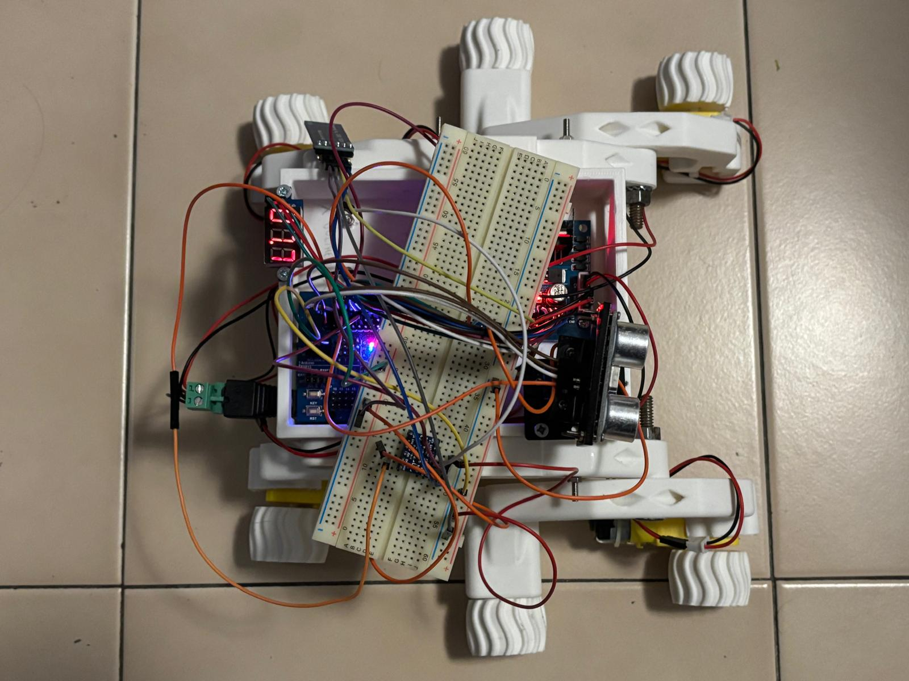

<h1 align="center">The Mars Rover</h1>

With this project we aim to get a better understanding of what skills developing a Mars Rover takes.

<i>"How does a Rover really work?","What defines a Rover?","How can we make it connect to an external Module?"</i>

While it would be challenging to build a full Mars Rover in a limited timeframe, understanding how they work and the challenges engineers face can give us a greater appreciation for the level of innovation and precision that goes into their development.

<h3 align="center">The finished Product</h3>

<h3 align="center">Components</h3>

<ul list-style-type: "square">
    <li>a few (a lot) 3d printable components</li>
    <li>4x mini servomotors of 3v outtage</li>
    <li>27x Jumpers Arduino</li>
    <li>1x Micro Servo otor SG90</li>
    <li>1x Arduino compatible Voltometer</li>
    <li>1x Arduino OSOYOO UNO Board</li>
    <li>1x Arduino ESP8266 Shield for Arduino</li>
    <li>1x Buzzer compatible with Arduino</li>
    <li>1x MOdule Driver Motors OSOYOO Model X</li>
    <li>1x Bluetooth sensor Arduino compatible</li>
    <li>1x IR sensor Arduino compatible HC-SR04</li>
    <li>x Various screws and knobs to model the Body of the Rover</li>
    <li>1x Texas Instruments MSP43P401R</li>
    <li>1x Texas Instruments BoosterPack</li>
</ul>

<h3 align="center">Software</h3>

<ul>
    <li>Visual Studio Code</li>
    <li>Arduino INO IDE</li>
    <li>Code Composer Studio</li>
    <li>Energia IDE</li>
    <li>Putty Serial Communication App</li>
</ul>

<h3 align="center">Project Layout</h3>

<pre>
<code>
ROVER
│
├── README.md
├── LICENSE (MIT defined)
├── rover_exoscheleton              # stl used for the exoskeleton of the rover
├── images_readme                   
│   └──images                       # images used inside the readme
├── images_schematics               
│  └──images                        # images with the schematics of the Arduino jumpers connections in the Rover
├── presentation!!                  # presentation of the project
└── Our Code
    ├── ArduinoUNO                   # Arduino side code
    │   ├── ComponentsCode                      # Components template code with testing before implementation
    │   └── RoverFinalSketch                    # Final sketch to be burned into the Rover
    ├── MSP43P401R                   # Texas side code
    └── SideCode                     # Side code to make the BLE module to connect to the pc 
</code>
</pre>

<h3 align="center">How to Reproduce the Project</h3>

<h3 align="center">Contributors</h3>

<i>Agosti Tommaso, Nodari Francesco, Wu Alessio, Wu Davide</i>

